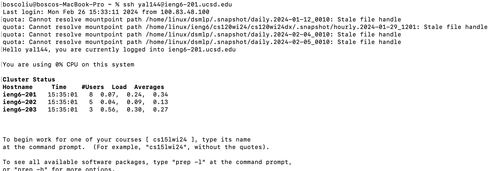
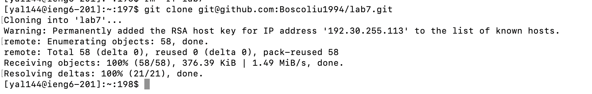
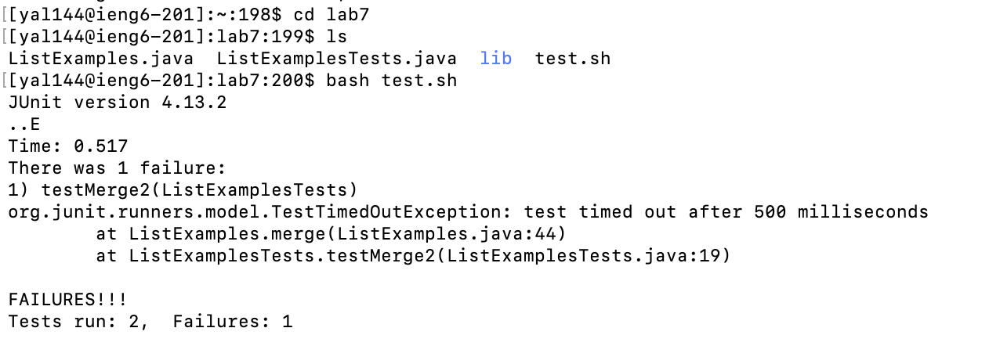
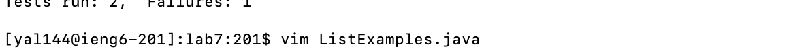
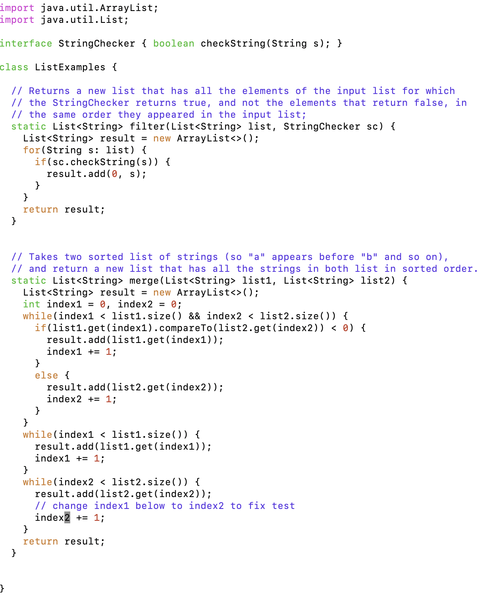
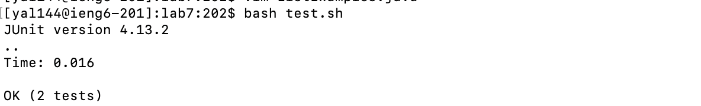
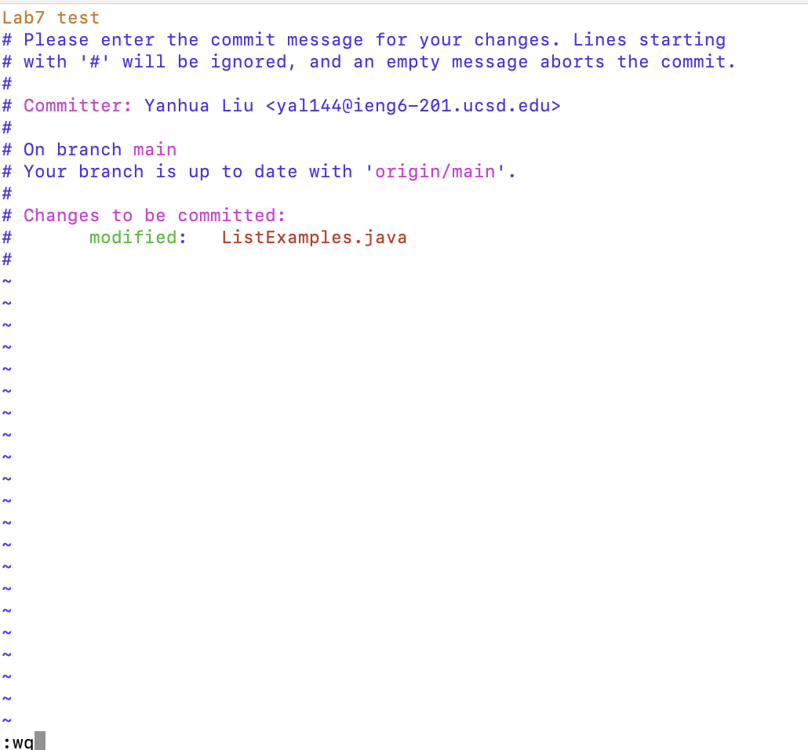
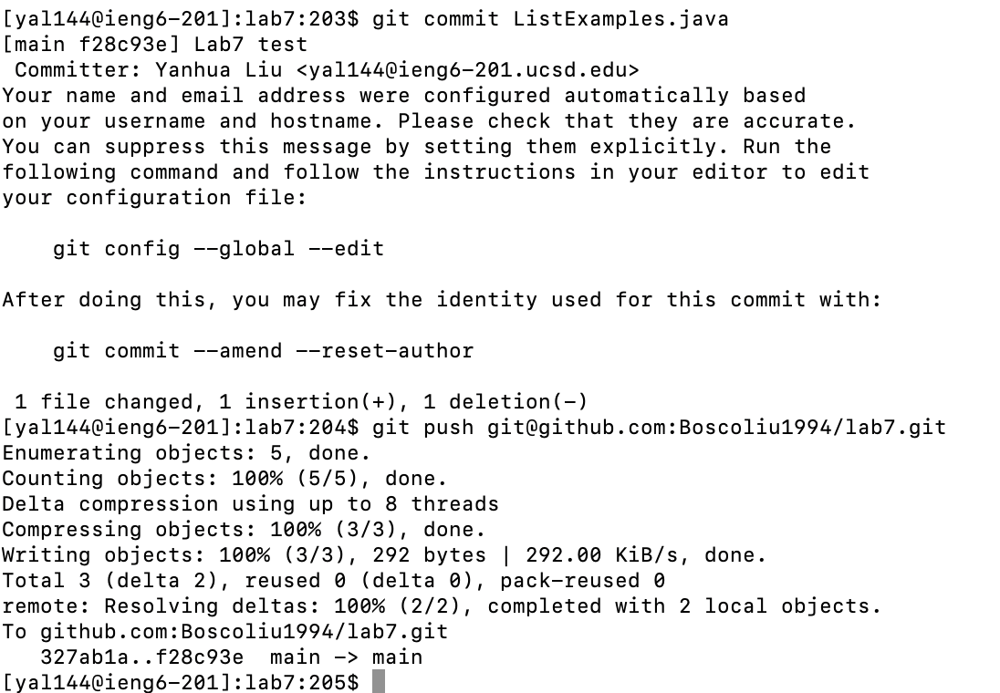

# Lab Report 4 - Vim (Week 7)

## 1.Log into ieng6

### Key pressed: 
`ssh yal144@ieng6-201.ucsd.edu -> <Enter>`

## 2.Clone your fork of the repository from your Github account (using the SSH URL)

### Key pressed: 
`git clone git@github.com:Boscoliu1994/lab7.git -> <Enter>`

## 3.Run the tests, demonstrating that they fail

### Key pressed:
`cd lab7 -> ls -> bash test.sh -> <Enter>`

## 4.Edit the code file to fix the failing test

****

### Key pressed:
`vim ListExample.java -> <Enter> -> Shift + g -> k(6 times) -> e -> x -> i -> 2 -> esc(keyboard) -> :wq -> <Enter>`

## 5.Run the tests, demonstrating that they now succeed

### Key pressed:
`bash test.sh`

## 6.Commit and push the resulting change to your Github account (you can pick any commit message!)

****

### Key pressed:
`git commit ListExamples.java -> <Enter> -> i -> Lab7 test -> esc(keyboard) -> :wq -> <Enter>`
and then `git push git@github.com:Boscoliu1994/lab7.git -> <Enter>`
